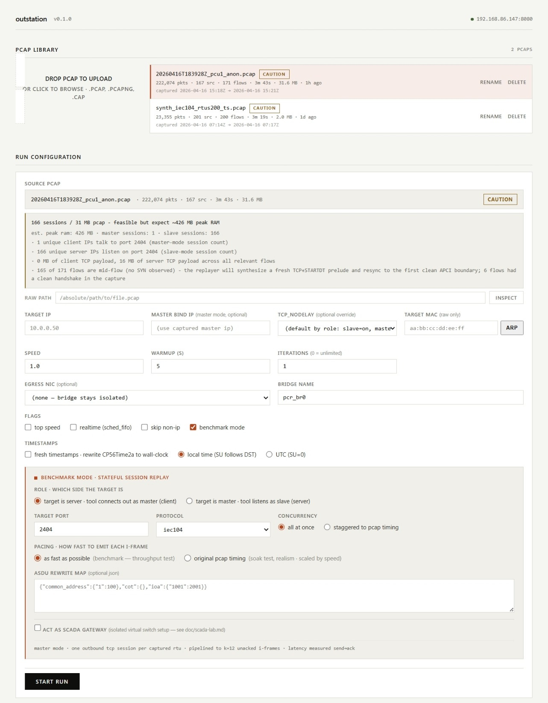
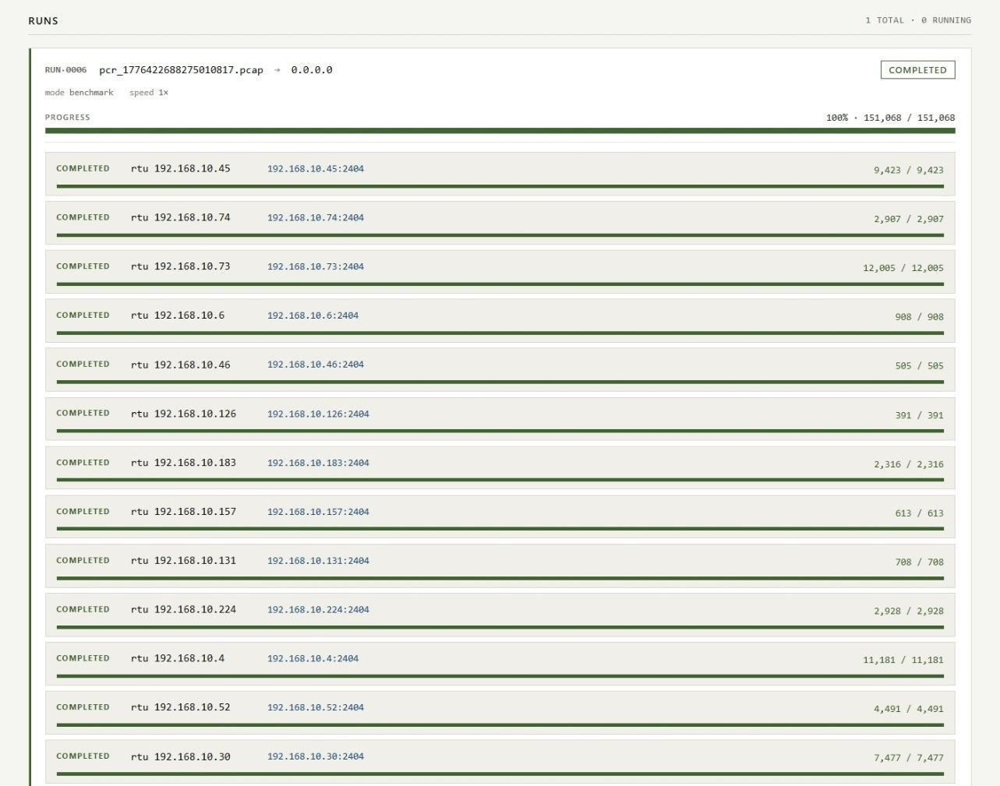
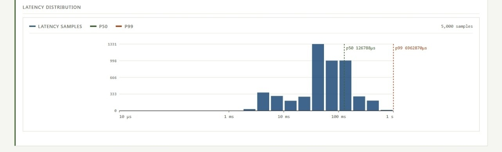
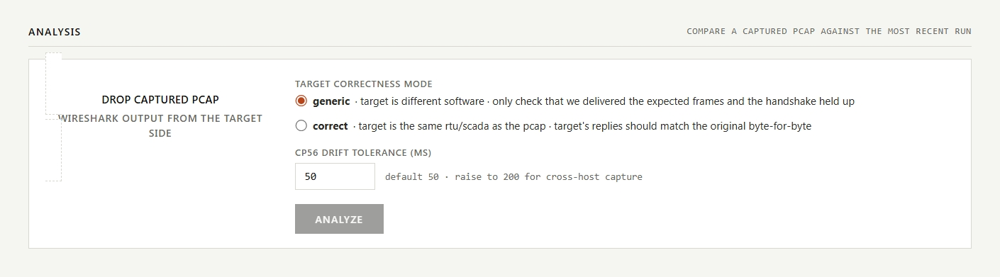
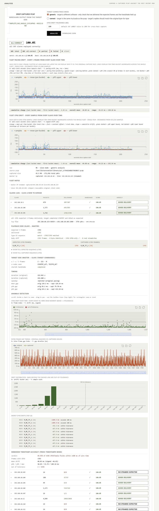

# outstation

[](#license)
[](https://www.rust-lang.org)
[](#requirements)

A stateful SCADA traffic simulator for Linux that replays captured IEC 60870-5-104 traces as live TCP sessions on the wire — one session per captured RTU — with per-message latency metrics and post-run fidelity verification. Built for benchmarking and regression-testing SCADA systems with real captured RTU traffic.

Driven entirely from a browser UI — upload a pcap, configure a run, press start, watch live progress and latency charts. No CLI workflow, no scripting. The browser owns the full loop.

---

## Table of contents

- [Why](#why)
- [What makes it different](#what-makes-it-different)
- [How it works](#how-it-works)
- [Features](#features)
- [Protocol support](#protocol-support)
- [Quick start](#quick-start)
- [Generating synthetic IEC 104 pcaps](#generating-synthetic-iec-104-pcaps)
- [Examples directory](#examples-directory)
- [Documentation](#documentation)
- [Replay fidelity vs the IEC 60870-5-104 standard](#replay-fidelity-vs-the-iec-60870-5-104-standard)
- [Crate layout](#crate-layout)
- [Requirements](#requirements)
- [Safety and scope](#safety-and-scope)
- [License](#license)

---

## Why

Running realistic traffic against a SCADA server is harder than it sounds. You can capture a pcap from production with traffic from 200 RTUs, but you can't just `tcpreplay` it — the target SCADA has a whitelist of real RTU IPs, it expects real TCP sessions, the captured flows need to be reassembled per-RTU and driven through the IEC 60870-5-104 state machine (STARTDT, k-window, I-frames, S-frame acks, TESTFR), and you need per-message latency measurements out the other end so you can tell whether the SCADA is handling the load.

outstation does all of this from a single binary with a browser UI. It scales to ~200 RTUs / ~10 k messages per second on a single modest VM, and the whole thing is designed around letting you run it against a real SCADA test server **without changing anything inside the SCADA guest** (see [`doc/scada-lab.en.md`](doc/scada-lab.en.md)).

## What makes it different

Most pcap replay tools treat a capture as bytes to retransmit. outstation treats a capture as *behaviour to impersonate*. `tcpreplay` streams L2 packets at an interface with optional address rewrite; `tcpliveplay` drives exactly one live TCP flow but has no application-layer knowledge; Scapy scripts and `bittwist` work one flow at a time and leave everything else to you. None of them can stand in for 200 RTUs, measure per-message latency under real load, or tell you after the fact whether the replay was faithful. This is the shape of the gap:

- **Protocol participant, not a packet blaster.** In benchmark mode outstation opens a real TCP socket and runs a full IEC 60870-5-104 state machine — APCI framing, I/S/U frames, live N(S)/N(R) sequencing, k-window flow control, t1/t2/t3 timers, STARTDT/STOPDT, TESTFR keepalives, per-frame ACK tracking (`crates/proto_iec104/src/session.rs`). A live SCADA master or slave on the other end gets a real counterpart it can actually talk to, not a stream of stale packets with fresh checksums.
- **Many-to-one and one-to-many SCADA fan-out on a single host.** One run impersonates **200 RTUs to one master** (slave mode) or **200 masters to one SCADA server** (master mode), all on one host, all on standard port 2404, differentiated purely by IP. Slave mode auto-installs and auto-removes /32 IP aliases per listener; master mode builds per-session veth ports on a private bridge so 200 outgoing TCP clients cleanly bind to 200 distinct source addresses. Neither of these requires hand-rolled shell scripting to operate.
- **Built-in fidelity analysis.** After a run the analyser reopens the mirrored capture pcap from the wire and compares it flow-by-flow against the source pcap: how many I-frames were delivered, whether the type-ID sequence matches, how many frames are byte-identical, the drift in inter-frame timing, and a verdict / score (`crates/webui/src/analysis.rs`). No other replay tool I know of ships verification as a first-class feature — with `tcpreplay` you capture on the wire yourself and diff by hand if you care at all.
- **Timing-preserving pacing.** `Pacing::OriginalTiming { speed }` replays each I-frame at its original pcap-relative timestamp so the temporal shape of the telemetry feed is preserved — the natural pauses, the bursts, the outliers. A real 175-second IEC 104 session replays with ~20 ms total wall-clock drift and <1 ms mean inter-frame delta (see [`fidelity_report_run2.md`](fidelity_report_run2.md)). `AsFastAsPossible` is available when you want raw throughput instead. `tcpreplay`'s `--mbps` / `--multiplier` are packet-rate knobs, not protocol-frame-aware pacing — they can't keep a "pause 6 seconds, then burst 4 frames" shape.
- **Two-way: master *and* slave.** outstation can impersonate either side of the conversation — test your substation RTUs, then swap and test the control centre's master — from the same UI, without changing tools. Most replay tools do one direction at best.
- **Per-session live observability.** Every RTU is a row in the UI with its own state (`pending` / `listening` / `connected` / `active` / `completed` / `failed` / `cancelled`), live send/receive counters, byte counts, and per-session stop. An ECharts hub-and-spoke diagram renders the active topology in real time with animated streams per direction and per-rate bucket. `START ALL` / `STOP` fan out across the whole run with one click.
- **Benchmark metrics, not "did it finish".** Per-session send→ack latency sampled into a bounded reservoir, rolled up to p50/p90/p99 histograms across the whole run; window-stall counts, unacked-at-end tallies, throughput in msg/s, per-session byte accounting. If you're load-testing a real SCADA server, the latency distribution is the thing that actually matters — and you get it without additional tooling.
- **Synthetic SCADA traffic generation.** `gen_iec104_traffic.py` produces standards-conformant IEC 104 pcaps at arbitrary scale — configurable RTU count, IP subnet, ASDU address space, points per RTU, inter-event cadence, sequential or random IP allocation. Useful when you want to stress-test against scenarios you don't have real captures for.
- **Safe for the host it runs on.** Every topology change is wrapped in RAII guards that restore on drop: bridge lifecycle, veth pairs, IP aliases, sysctls, iptables rules, NIC tx-checksum offload. A state file on disk lets aliases be reclaimed after a crash. A killed or panicked run does not leave your network in a weird state next boot.
- **Browser, not CLI.** Upload, configure, run, monitor, stop, abort, download the replay capture, read the fidelity report — all in one UI. No shell scripting, no per-RTU `ip addr add`, no bespoke glue. A pcap library, SQLite-backed run history, per-run delete, per-pcap viability analysis at upload time. Single binary `outstation serve`, single systemd unit.

The one-line version: *every other pcap replay tool treats a capture as traffic to retransmit; outstation treats a capture as behaviour to impersonate*, and ships the protocol stack, the per-flow fan-out, the live UI, and the post-run fidelity verification needed to back that up.

## How it works

```
                         ┌──────────────────────────────────────┐
       browser UI ───▶   │    webui crate  (axum + SPA)         │
   (upload pcap,         │    ─ pcap library                    │
    configure run,       │    ─ run config form                 │
    watch live)          │    ─ live diagram / latency charts   │
                         │    ─ SQLite run history              │
                         └────────────────┬─────────────────────┘
                                          │
                                          ▼
┌─────────────────────────────────────────────────────────────────┐
│              sched crate  (orchestrator + RunContext)           │
│                                                                 │
│   run()                      │     run_benchmark()              │
│   ─ raw replay path          │     ─ stateful session replay    │
│   ─ per-source veth worker   │     ─ per-RTU TCP client         │
│   ─ AF_PACKET injection      │     ─ IEC 104 windowed send loop │
│   ─ µs-accurate scheduler    │     ─ send→ack latency measured  │
└──────────┬──────────────────────────────┬──────────────────────┘
           │                              │
           ▼                              ▼
   ┌──────────────┐                ┌──────────────────┐
   │ raw_replay   │                │ proto_iec104     │
   │ + rewrite    │                │ (ProtoReplayer)  │
   │ + pcapload   │                │                  │
   └──────┬───────┘                └─────────┬────────┘
          │                                  │
          └──────────────┬───────────────────┘
                         ▼
                  ┌───────────────┐
                  │ netctl crate  │  bridge + veth lifecycle,
                  │               │  IP aliases, egress guard,
                  │               │  SCADA-gateway guard
                  └───────┬───────┘
                          │
                          ▼
                    Linux kernel
                 (AF_PACKET, veth, bridge, iptables)
```

Every run is reversible: the bridge, veth pairs, IP aliases, sysctl state, iptables rules, and tx-checksum NIC settings are all captured in RAII guards that restore on Drop. A crash-safe state file lets the server reclaim orphaned aliases on restart.

## Features

### Two replay modes

- **Raw replay** — per-source veth ports on an auto-managed Linux bridge, per-frame L2/L3 rewrite with checksum recompute, AF_PACKET injection at microsecond accuracy. For feeding IDS / logger / historian systems.
- **Stateful session replay (benchmark mode)**, with two roles:
  - **Master** — outstation connects out as a TCP client of `target_ip:target_port`, one real session per captured RTU, driven by a protocol-aware replayer. Pipelined to the protocol's native k-window; per-message send→ack latency recorded via reservoir sampling and rendered as p50/p90/p99 histograms.
  - **Slave** — outstation binds one listener per captured RTU on the RTU's own IP at `listen_port_base` (default 2404), auto-aliases the RTU IP onto the default-route interface, and waits for a live master to connect in. Works with external master tools like RedisAnt's `iec104client`.

### Slave-mode ergonomics

- Each listener is pre-populated with the RTU's captured IP as its `listen_ip`, so 200 sessions come up as 200 distinct `rtu_ip:2404` endpoints on one NIC without any manual config. Aliases are added before bind and removed on session end; a state file at `/var/lib/outstation/state-aliases.txt` lets startup reclaim them after a crash.
- All listeners share the same port (no port shifting) — only the IP discriminates sessions. A real SCADA master can walk the RTU IP list with `:2404` everywhere instead of chasing 200 different ports.
- **START ALL** button in the run detail panel fans out the ready flag to every pending listener in one click. **STOP** on the run card fans out cancellation to all sessions in one click and flips them to `CANCELLED` so the UI doesn't keep showing stale `PENDING` rows.
- Each session reports its own state (`PENDING → LISTENING → CONNECTED → ACTIVE → COMPLETED / CANCELLED / FAILED`) with live send/receive counts, byte counts, and per-session abort.

### Using the web UI

The single `outstation serve` binary hosts everything over `:8080`.
A run moves through five screens in order — library, configuration,
live replay, per-session results, and analysis — with the session
history persisted to SQLite so refreshing the tab or restarting the
service never loses a completed run.

#### 1. Library + run configuration



Top card is the **pcap library**; bottom card is **Run Configuration**.

- **Upload.** Drop a `.pcap`, `.pcapng`, or `.cap` file anywhere on the
  library upload area. Each file becomes a library row.
- **Viability advisory.** The analyser runs on upload and tags the row
  with `OK` / `CAUTION` / `HEAVY` / `NOT RECOMMENDED` plus a one-line
  reason — e.g. *"165 of 171 flows are mid-flow — the replayer will
  synthesize a fresh TCP+STARTDT prelude and resync to the first
  clean APCI boundary"*.
- **Pick a pcap.** Clicking a library row promotes it to the source
  pcap for the next run and pre-populates the form below.
- **Run form.** Target IP + MAC (MAC is raw-replay only), source-port
  bind, `TCP_NODELAY` override, speed, warmup, iteration count,
  and the usual flags (top speed, realtime, skip non-IP).
- **Protocol-specific knobs.** Hidden by default; visible only when
  the matching protocol is picked in the `PROTOCOL` dropdown. For
  IEC 104 that's the CP56Time2a rewrite + timezone controls and
  the ASDU rewrite map.
- **Benchmark mode.** Tick the box to expose the benchmark panel —
  role (`master` = tool dials out, `slave` = tool listens), target
  port, concurrency model, pacing strategy, and the SCADA-gateway
  toggle for subnet-isolated targets.
- **`START RUN`.** Hands everything to the scheduler and transitions
  the page to the live-replay view.

#### 2. Live replay + per-session control


Top card is the **live traffic diagram**; bottom card is the
**session grid** for the running benchmark.

- **Hub-and-spoke diagram.** Target at the centre, one node per
  captured RTU around it. Animated particle streams are sized by
  real packet-per-second rate and bucketed so a 1 pps session looks
  visibly different from a 1 000 pps one. `FULLSCREEN` pops it out
  for projection on a separate monitor.
- **Live counters.** `SENT`, `UPLINK PPS`, `DOWNLINK PPS`, and
  `ACTIVE / STREAMS` (active session count vs planned fleet size).
- **Session grid.** One row per captured RTU. In slave-mode runs
  each row is parked at **`PENDING`** with the listener IP:port
  prefilled from the capture.
- **Per-row controls.**
    - `VERIFY` — check address reachability without opening a socket.
    - `START LISTENING` — flip the ready flag; the row then walks
      `LISTENING → CONNECTED → ACTIVE → COMPLETED` as the target
      master connects in.
    - `ABORT` — cancel a single session without disturbing the rest.
- **Fleet controls.** `START ALL (N)` fans the ready flag across
  every pending row in one click.

#### 3. Session progress as the run unfolds



- **Per-row progress bar** fills toward the `delivered / planned`
  message count (green when running cleanly, red on stalls).
- **Update cadence.** Scheduler atomics are streamed over WebSocket
  every 250 ms — no page refresh, no polling.
- **Completion.** When every session hits 100 % the run-card status
  flips to `COMPLETED`.
- **Diagnostics-at-a-glance.** A row stuck red or stalled at an
  intermediate count is the cheapest answer to *"did the SCADA
  even handshake with this RTU?"* — no need to pull up a packet
  capture.

#### 4. Run detail + per-session benchmark


Click `SHOW DETAILS` on a completed run card.

- **Throughput sparkline.** Aggregate pkts/s over the run. A dropoff
  near the end usually means the target sat on its flow-control
  window.
- **Stat strip.** Copy-paste-ready one-liner: pcap path, target,
  speed, session count, total messages, mean throughput, and the
  full latency percentile set (min / p50 / p90 / p99 / max).
- **Per-session benchmark table.** One row per RTU sorted by `SENT`
  volume.
    - `SENT / RECV` — message counts each way.
    - `P50 / P99 / MAX ms` — per-session latency.
    - `MSG/S` — sustained throughput.
    - `STALLS` — times the replayer blocked on the target's flow-
      control window. A non-zero value here is the first thing to
      check when the fleet's mean throughput looks low.
    - `STATUS` — `ok` or the failure tag.
- **Actions.** `DELETE` removes the run from history; download links
  above expose the mirror pcap that feeds the analyser.

#### 5. Latency distribution



Send → ACK latency for the run, rendered as a histogram.

- **Log X-axis** (10 µs → 1 s) so sub-millisecond tails and multi-
  second outliers both land in the same view.
- **p50 / p99 markers** — dashed vertical lines with their exact µs
  values called out.
- **Shape tells you the story.**
    - A single tall peak = the target is responding at a steady rate.
    - A long right tail = individual ACKs are sitting behind the
      flow-control window or a slow target thread.
- **Sample cap** (top-right) so there's no ambiguity about whether
  the distribution was truncated.

### Post-run fidelity analysis

- The analyser (`crates/webui/src/analysis.rs`) re-opens the mirror capture from the run and compares it flow-by-flow against the source pcap: expected vs delivered I-frame counts, type-ID sequence agreement, byte-identical frame count, inter-frame timing drift (mean / p50 / p99), and a verdict (`good_delivery`, `partial_delivery`, `no_session`) with a score.
- Flow pairing is pinned on the captured session's server IP, so in a 200-RTU pcap the analyser always compares the right source flow against the right captured flow.
- A sample report produced end-to-end from a 200-RTU run is in [`fidelity_report_run2.md`](fidelity_report_run2.md).

#### Upload a capture



- **Drop zone.** Drop a Wireshark capture taken *on the target side*
  into the dashed box on the left.
- **Analysis mode.**
    - **`generic`** — target is different software from the one in
      the source pcap. Only delivery and handshake completion are
      scored.
    - **`correct`** — target is the same RTU / SCADA. The target's
      own I-frames are additionally compared byte-for-byte against
      the captured server-side flow.
- **`CP56 DRIFT TOLERANCE (MS)`** — the ±band outside of which a
  per-frame stamp-vs-wire drift counts as an anomaly.
    - 50 ms — tight, intra-host runs.
    - 200 ms — realistic when the target capture comes from a
      different VM.
- **`ANALYZE`.** Runs the comparison and renders the report below.

#### Reading the report



Top to bottom:

- **Top-right controls.** `ANALYSIS MODE`, `CP56 DRIFT TOLERANCE
  (MS)`, `ANALYZE`, and `DOWNLOAD JSON` (dumps the raw report for
  offline inspection).
- **Top banner.** Overall verdict badge (`ALL CORRECT` / `PARTIAL` /
  `FAILED` / …) with the fleet score next to it, followed by the
  per-bucket counts: total, all-correct, partial, failed, silent.
- **Fleet pacing drift.** One dot per I-frame. X = seconds since
  capture start, Y = ms that the live replay sent that frame later
  than the original capture pace.
    - **Orange** = per-bucket mean across the fleet. Flat ≈ 0 means
      the replayer held pace; an upward slope means it's falling
      behind.
    - **Green dashed** = p95 upper. **Red dashed** = p05 lower.
    - **Dashed vertical lines** mark iteration boundaries on loop runs.
    - **Stats strip** below: cumulative change (last bucket mean −
      first bucket mean), overall mean, and min → max.
- **Fleet CP56 drift.** Same layout, Y-axis is signed stamp-vs-wire
  drift in ms — *only populated when the run had fresh-timestamps
  mode on*.
    - A flat line = constant clock offset (NTP skew).
    - A slope = the offset itself is drifting.
    - Dots outside the ±tolerance corridor are the frames flagged
      as anomalies.
- **Run context.** `run` (id, role, mode), `source pcap`, `captured
  size` + packet count, `master ip` mapping with a `(renamed)` tag
  when captured-side and live-side master IPs differ. Informational —
  slave matching is pinned on slave IP, not master IP.
- **Fleet notes.** Global observations the analyser surfaced at
  rollup time (e.g. the master-IP rename above).
- **Slaves table.** One row per RTU in the source pcap, sorted
  worst-score-first. Columns: slave IP · packets seen · delivered /
  expected I-frames · STARTDT handshake ✓/✗ · score · verdict tag.
  Click any row to expand its drill-down.
- **Per-slave drill-down** (everything below the row). Starts with
  the `TCP FLOW` identity, then four protocol-specific sections,
  all powered by `crates/proto_iec104/src/analysis.rs` and
  rendered by `crates/proto_iec104/static/iec104_ui.js`:

    - **`PLAYBACK SIDE`** — what outstation was supposed to emit.
        - `expected / delivered` I-frame counts.
        - Type-ID sequence match verdict.
        - Three-way body-diff breakdown: byte-identical vs
          CP56-only (timestamps we deliberately rewrote) vs real
          mismatches.
        - Side-by-side type-ID histogram (EXPECTED vs CAPTURED)
          with per-type deltas, plus a collapsible full-sequence
          dump for byte-level inspection.

    - **`TARGET SIDE`** — what the live peer sent back.
        - U / S / I frame counts.
        - List of U-codes seen (`STARTDT_ACT`, `STARTDT_CON`,
          `TESTFR_ACT`, …).
        - Handshake-completion flag.
        - Single-column type-ID histogram of the target's I-frames.
        - In `correct` mode: target-script comparison (`same_script`
          / `subset` / `divergent` / `silent`) with LCS similarity
          to the original capture.

    - **`TIMING`** — per-slave original vs captured run durations,
      speedup-factor label (fast mode vs original pacing), and
      mean / p50 / p99 inter-frame gap statistics side by side.

    - **`ANOMALY DETECTION`** — interactive charts.
        - **CP56 drift over time** — every per-frame signed drift
          against frame index, with the ±tolerance band shaded
          green; in-tolerance dots green, out-of-tolerance dots red.
        - **Inter-frame gap timing** — original (dashed) vs captured
          (solid) gap duration per index.
        - **Drift distribution** — `|drift|` bars in buckets with a
          dashed line at the tolerance threshold.
        - **Worst CP56 drifts (top 10)** — callout list ranks the
          frames most at risk.

    - **`EMBEDDED TIMESTAMP ACCURACY`** — fresh-timestamps-mode
      summary.
        - Verdict (within-tolerance % of CP56 samples).
        - Frames-with-CP56 count.
        - mean / p50 / p99 / max drift.
        - Out-of-tolerance count.
        - Any `IV` / `SU` flags observed.

### Networking

- Multi-RTU pcaps are dispatched one worker per source IP, each with its own veth port on a private Linux bridge. Source IPs and source MACs are preserved byte-identical to the capture; only the destination is rewritten.
- Automatic /32 alias management on a chosen egress NIC, with state-file-backed reclaim so a crashed process doesn't leak aliases across restarts.
- **SCADA-gateway mode** — outstation can claim the SCADA test server's default-gateway IP on an isolated vSwitch, so off-subnet return traffic routes back to outstation without changing anything inside the SCADA guest. Optional upstream NAT keeps SCADA's non-capture egress flowing out a second NIC. Walkthrough in [`doc/scada-lab.en.md`](doc/scada-lab.en.md).
- Egress safety guard disables `bridge-nf-call-iptables` and NIC TX checksum offload for the duration of a run, installs an `iptables raw PREROUTING DROP` rule so injected bytes never leak into the host's own stack, and reverts everything on run teardown.

### Runtime

- Single-binary `outstation serve` that hosts the browser UI over axum.
- Live network diagram rendered with ECharts (vendored locally, no CDN) — animated streams with real rate, separate send/receive lanes, per-session bucketing, 200-stream cap.
- Live per-RTU progress bars, throughput sparkline, cooperative stop button.
- Post-run artifacts: downloadable replay pcap (the bytes that actually hit the wire), inter-frame gap histogram (original vs captured overlay), per-session latency histogram.
- SQLite-backed run history — all runs persisted across restarts, in-process runs marked failed on startup so the UI never shows phantom "running" rows, per-run delete endpoint and UI button.
- Pcap library: upload, rename, delete, per-pcap viability analysis at upload time.
- Scales to ~200 concurrent RTU sessions, ~10 k messages/sec aggregate, ~30–60 minute pcaps on commodity hardware.

## Protocol support

| Protocol | Crate | Status |
|---|---|---|
| IEC 60870-5-104 | `proto_iec104` | **shipped** — full k/w-window state machine, STARTDT/STOPDT/TESTFR, ASDU rewrite (common address / COT / IOA), send→ack latency |
| Modbus/TCP | `proto_modbus_tcp` | stub |
| DNP3 over TCP | `proto_dnp3_tcp` | stub |
| IEC 61850 MMS | `proto_iec61850_mms` | stub |
| IEC 60870-6 ICCP | `proto_iec60870_6_iccp` | stub |

New protocols plug in by implementing the `ProtoReplayer` trait in `crates/protoplay/src/lib.rs` — nothing in `sched`, `webui`, or the run pipeline is specific to IEC 104.

## Quick start

```sh
# Build
cargo build --release

# Run (needs CAP_NET_ADMIN + CAP_NET_RAW — use sudo or the systemd unit)
sudo ./target/release/outstation serve --bind 0.0.0.0:8080

# Open the UI in a browser
xdg-open http://localhost:8080
```

For a production install, see [`systemd/install.sh`](systemd/install.sh) which sets up the unit, ambient capabilities, and directory layout (library at `/var/lib/outstation/library`, captures at `/tmp/outstation-captures`, SQLite history at `/var/lib/outstation/runs.sqlite`).

### First run in 60 seconds

1. Open the UI. Go to **Pcap Library** and drop in a pcap or pcapng file.
2. Wait for the per-upload viability analysis to finish (packet count, RTU count, TCP flows).
3. Go to **Run Configuration**. Pick the pcap. Enter the target IP (and MAC for raw mode). Pick egress NIC.
4. Tick **benchmark mode**. Choose role (`master` = tool connects out, `slave` = tool listens). Choose pacing (`fast` for throughput tests, `original` for realism).
5. Optional: tick **act as scada gateway** and fill in the gateway IP + inner NIC (see [`doc/scada-lab.en.md`](doc/scada-lab.en.md)).
6. **START RUN**. Watch the live diagram, the per-RTU progress bars, the throughput sparkline, and the latency histogram.
7. When it's done, click **DETAILS** on the run card to see p50/p90/p99 latency, per-session breakdown, and download the replay capture.

## Generating synthetic IEC 104 pcaps

If you don't yet have a real capture to replay, or want to stress-test at a specific scale, use the traffic generator in [`examples/gen_iec104_traffic.py`](examples/gen_iec104_traffic.py). It produces standards-conformant IEC 60870-5-104 pcaps with one TCP conversation per RTU — master-initiated three-way handshake, TESTFR/STARTDT handshake, general interrogation → inrogen burst → ActTerm, then a spontaneous monitor stream with periodic S-frame acks and TESTFR keepalives, then STOPDT close. Zero-dependency: standard library Python 3 only.

### Minimal example

```sh
python3 examples/gen_iec104_traffic.py \
  --rtus 200 \
  --duration 180 \
  --subnet 192.168.10.0/24 \
  --rtu-start-offset 2 \
  --master-ip 192.168.86.1 \
  --mean-interval 1.5 \
  --seed 20260414 \
  -o synth_iec104_rtus200_lan10.pcap
```

That writes a ~2.8 MB pcap with 200 RTU listeners bound sequentially to `192.168.10.2..201:2404`, one external master at `192.168.86.1`, and ~180 s of simulated telemetry per RTU at a 1.5 s mean inter-event gap.

### Useful flags

| flag | default | meaning |
|---|---|---|
| `-n`, `--rtus` | `5` | number of synthetic RTUs to generate |
| `-d`, `--duration` | `120` | seconds of telemetry per RTU |
| `--master-ip` | `10.20.100.108` | SCADA master IP (TCP client side) |
| `--master-mac` | `02:00:5e:00:64:6c` | master L2 address |
| `--rtu-port` | `2404` | TCP port the RTUs listen on |
| `--subnet` | `10.20.102.0/24` | CIDR the RTU IPs are allocated from |
| `--rtu-start-offset` | `2` | lowest host offset inside `--subnet` (so `.1` stays free for a gateway) |
| `--mean-interval` | `3.0` | mean gap between spontaneous events per RTU, seconds |
| `--jitter` | `0.5` | fractional jitter on the inter-event distribution |
| `--points-per-rtu` | `12` | distinct IOAs each RTU reports |
| `--seed` | _random_ | deterministic PRNG seed for reproducible pcaps |
| `--start-time` | _now_ | epoch seconds for the first packet |
| `-o`, `--output` | _timestamped_ | output path (default: `synth_iec104_<UTC>_rtus<N>.pcap` in CWD) |

RTU IPs are allocated **sequentially** starting at `--rtu-start-offset`, skipping the master if it happens to fall in the same subnet. Each RTU gets its own random MAC, random ASDU common address (`1..65534`), and a sorted sample of `--points-per-rtu` random IOAs from `1..9999`. Spontaneous events are exponentially distributed around `--mean-interval` with uniform jitter, and each event is a single-point / double-point / short-float measurement drawn at weighted random.

### Typical workflow end-to-end

1. `python3 examples/gen_iec104_traffic.py -n 200 -d 180 --subnet 192.168.10.0/24 -o my_rtus.pcap`
2. Upload `my_rtus.pcap` to the outstation library via the browser UI.
3. New run → `slave` role → `listen_port_base = 2404` → `protocol = iec104` → **START RUN**.
4. Click **START ALL** in the run detail panel to arm every listener.
5. Point your master tool at any RTU IP in `192.168.10.2..` on port 2404 (all 200 listen on the same port).
6. When the run ends, click **DOWNLOAD CAPTURE** on the run card, then re-upload the captured pcap to `POST /api/analyze?run_id=<id>` to get a JSON fidelity report.

See [`fidelity_report_run2.md`](fidelity_report_run2.md) for a human-readable version of one such report — 100 % byte-identical delivery, ~20 ms total drift over 175 seconds.

## Examples directory

Everything needed to reproduce a working 200-RTU replay lives under [`examples/`](examples/):

- [`examples/gen_iec104_traffic.py`](examples/gen_iec104_traffic.py) — the synthetic IEC 104 traffic generator described above.
- [`examples/synth_iec104_rtus200_lan10.pcap`](examples/synth_iec104_rtus200_lan10.pcap) — a 200-RTU pcap on `192.168.10.2..201` with one master at `192.168.86.1`, ~180 s duration, ~2.8 MB, suitable for slave-mode runs against an external IEC 104 master on any LAN where the RTU subnet is routable.
- [`examples/anonymize_pcap.py`](examples/anonymize_pcap.py) — standalone pure-Python 3 stdlib tool that anonymises IEC 104 pcaps for safe sharing. Reads libpcap and pcapng; remaps every IPv4 address (into a user-supplied subnet), MAC (to random locally-administered), IEC 104 Common Address (16-bit), and IEC 104 IOA (24-bit) with a consistent per-value mapping. Recomputes IPv4/TCP/UDP checksums, preserves IOA=0 and CA=0/0xFFFF sentinels, leaves TCP/UDP ports alone, and passes non-IPv4 traffic through unchanged. Output: `<UTC>_<original-stem>_anon.pcap` plus a sidecar `.mapping.json` audit file. Zero dependencies — runs on offline Windows/Linux. Example: `python3 examples/anonymize_pcap.py capture.pcapng --subnet 10.200.0.0/16 --seed 42`.

Upload the pcap directly in the browser UI to skip the generator step.

## Documentation

- [`doc/scada-lab.en.md`](doc/scada-lab.en.md) — SCADA engineer's guide (English). Lab topology, step-by-step VMware/Proxmox/libvirt setup, SCADA-gateway mode walkthrough, result reading, troubleshooting.
- [`doc/scada-lab.md`](doc/scada-lab.md) — same guide in Norwegian.
- [`reports/`](reports/) — real-world benchmark results from production-shaped runs. Latest: [165-RTU IEC 104 fleet replay, 151 068 I-frames delivered with zero protocol mismatches](reports/2026-04-17-fleet-replay-showcase.md).

## Replay fidelity vs the IEC 60870-5-104 standard

A direct comparison of what the standard requires against what
outstation actually delivers, so a SCADA engineer can decide which
tests this tool is fit for and which it isn't. All measurements come
from the [165-RTU benchmark](reports/2026-04-17-fleet-replay-showcase.md);
all standard references are to **IEC 60870-5-104 Ed. 2.0 (2006) +
Amendment 1 (2016)**, the current edition.

### What the standard requires

The IEC 104 application layer (5-104 §5) governs three things:
**timer compliance**, **flow-control windowing**, and **APDU/ASDU
correctness**. It is silent on inter-frame pacing, on absolute
timestamp accuracy, and on replay tools.

| Standard requirement | Default | Permitted range |
|---|---:|---|
| **t0** — TCP connect timeout | 30 s | 1–255 s |
| **t1** — max wait for response after sending I-frame or U-frame | 15 s | 1–255 s (must be > t2) |
| **t2** — max wait before sending S-frame ACK | 10 s | 1–255 s (must be < t1) |
| **t3** — idle period before sending TESTFR_act keepalive | 20 s | 1 s – 48 h |
| **k** — max unacknowledged I-frames in flight | 12 | 1–32767 |
| **w** — max received I-frames before sending S-frame ACK | 8 | 1–32767 (recommended w ≤ ⅔·k) |
| **N(S) / N(R)** — sequence numbers | mod 2¹⁵ | 15-bit; wrap at 32768 |
| **STARTDT_act → STARTDT_con** | within t1 | else connection close |
| **CP56Time2a** representation | per IEC 60870-5-4 | 7 octets, 1 ms resolution |
| **CP56Time2a** absolute accuracy | **not specified** | application-defined |
| **Inter-frame wire pacing** | **not specified** | event-driven only |

### What outstation delivers (165-RTU benchmark, 222 074-packet pcap, 165 concurrent slave sessions)

| Behaviour | Outstation result | Standard tolerance | Margin |
|---|---|---|---|
| STARTDT_act → STARTDT_con response | Real handshake on every accept; sub-second under typical load | within t1 = 15 s | ~30× headroom |
| t2 — S-frame ACK before deadline | Honoured on every k/w boundary (else verdict ≠ all_correct) | < 10 s | spec-conformant by construction |
| t3 — TESTFR keepalive while idle | Slave drains incoming during pacing waits; replies TESTFR_con within ms of TESTFR_act receipt | within t1 = 15 s after the act frame | spec-conformant |
| k-window (12 frames in flight max) | Enforced; replayer blocks at k pending and resumes on ACK | k = 12 default | spec-conformant |
| N(S)/N(R) sequence | Renumbered fresh per session, monotonic mod 2¹⁵, ACK-tracked | mod 2¹⁵ | bit-correct |
| **Per-RTU duration drift** (replay vs original) | **41 ms worst case over 222 s** = 0.018 % | unspecified | far below the smallest spec timer (1 s resolution) |
| **Fleet-wide cumulative pacing drift** | **−4.60 ms over 223 s** = 0.0021 % | unspecified | three orders of magnitude below t2 |
| **Per-frame pacing variance** | p95 within ±50 ms of original schedule | unspecified | 1.7 % of t1 |
| **ASDU byte fidelity** (outside CP56Time2a) | **151 068 / 151 068 frames byte-identical** to source | exact byte match required for type-ID/COT/CA/IOA/value | bit-perfect |
| Type-ID sequence per RTU | Exact, in order, frame-for-frame across the fleet | implicit conformance requirement | bit-perfect |
| CP56Time2a representation | 7-byte layout per IEC 60870-5-4 (validated by ASDU diff) | per IEC 60870-5-4 | spec-conformant |
| CP56Time2a absolute accuracy | Within host clock skew (≤ 60 ms with NTP-disciplined hosts) | unspecified by 104; typical procurement spec 10 ms–1 s | meets/exceeds typical procurement specs when both hosts are NTP-synced |

### What this means for SCADA testing

| SCADA test category | What the test checks | Confidence with outstation | Why |
|---|---|---|---|
| **Functional / data-flow** | Does SCADA receive the right ASDU type IDs, COTs, IOAs, values, sequence? | **High** | Every captured I-frame is byte-identical outside CP56; type-ID order matches across the whole fleet (151 068/151 068 frames); 0 protocol mismatches measured. The SCADA cannot distinguish replayed traffic from a real RTU at the application layer. |
| **Conformance / interoperability** | Does the device the SCADA talks to obey the IEC 104 state machine — handshakes, timers, sequence numbers? | **High** | outstation participates in the protocol state machine (STARTDT/STOPDT, k/w, t1/t2/t3, N(S)/N(R)), not just packet replay. All timers honoured by construction (verdict drops below `all_correct` if violated). |
| **Performance / load** | Can the SCADA handle N concurrent RTUs at expected message rates? | **High** | One outstation host stands up 165 concurrent IEC 104 sessions delivering 274 k packets / 151 k I-frames in 223 s. Per-session latency reservoirs and fleet-wide pacing/drift charts surface the SCADA's behaviour under load directly. |
| **Real-time event verification** (event order) | Does SCADA's HMI / historian capture the same event sequence the field saw? | **High** | Type-ID and ASDU body sequence preserved bit-perfect per RTU. Any out-of-order or missing event in the SCADA is the SCADA's own. |
| **Real-time event verification** (absolute time) | Does SCADA timestamp events accurately? | **High** when both hosts NTP-synced | CP56 representation is bit-correct; absolute accuracy bound by inter-host clock difference. With NTP discipline (chrony / Meinberg `ntpd`), the analyser observes single-digit-to-tens-of-ms baseline. Fresh-timestamps mode rewrites CP56 to wall-clock send time so SCADA sees current event times rather than stale capture times. |
| **Latency / round-trip measurement** | What's the SCADA's command-to-acknowledge latency under load? | **High** for slave-mode response times | Per-session send→ACK latency reservoir-sampled to p50/p90/p99 across the fleet. Real wire timing, real flow control. |
| **Active control / closed-loop** | SCADA sends `C_SC_NA_1` / `C_DC_NA_1` / `C_SE_NC_1` etc., RTU acts on it, observed effect feeds back. | **Low** | outstation replays the captured I-frame stream; it does **not** implement RTU control-object state machines. A captured pcap that contains command-acknowledge round-trips will be replayed faithfully, but the replayed RTU does not actually *act* on commands the live SCADA sends; it just emits whatever was captured. |
| **Failure-mode / negative testing** | What happens when an RTU disconnects, drops frames, sends malformed APDUs, blocks ACKs? | **Medium** | Sessions terminate cleanly per pcap, but malformed-frame injection and active fault simulation are not provided. Disconnect testing works (kill a session), but fault patterns must be in the source pcap to be replayed. |
| **Cybersecurity / IEC 62351** | TLS, certificate auth, integrity protection. | **Out of scope** | Base IEC 104 is plaintext; TLS/auth lives in IEC 62351-3/5, not implemented here. |

### Confidence summary

For passive load, throughput, and protocol-correctness testing of a
SCADA system against an existing pcap, **outstation produces wire
traffic indistinguishable from real RTUs at the application layer**.
Every spec-defined timer is honoured by construction, every captured
I-frame is delivered byte-for-byte outside CP56, and the measured
fidelity envelopes (cumulative pacing drift, per-RTU duration drift,
CP56 timestamp drift) are between two and four orders of magnitude
below the standard's tolerance windows.

For closed-loop testing where the SCADA's commands must drive RTU
state changes, outstation is the wrong tool — that needs an active
IEC 104 server with a real point database (e.g., `lib60870`'s
`CS104_Slave` example, or a vendor-supplied simulator). outstation's
slave is faithful to *what the captured RTU said*, not to what a
*generic IEC 104 RTU should say in response to a fresh command*.

The most stringent quality metric the standard does specify — timer
conformance — passes by construction: any timer violation collapses
the per-session verdict below `all_correct`, and the headline of the
benchmark report is the inverted form of "this many sessions
violated a timer".

## Crate layout

```
outstation/
├── Cargo.toml                     workspace root, resolver = 2
├── crates/
│   ├── netctl/                    bridge + veth lifecycle, IP aliases,
│   │                              egress safety guard, SCADA-gateway guard
│   ├── pcapload/                  pcap + pcapng parsers, source/flow
│   │                              indexing, TCP reassembly
│   ├── rewrite/                   in-place L2/L3/L4 header rewrite
│   ├── raw_replay/                AF_PACKET sender with µs scheduling
│   ├── sched/                     orchestrator: run() and run_benchmark()
│   ├── tcp_session/               generic TCP client replayer
│   ├── protoplay/                 ProtoReplayer trait + shared types
│   ├── proto_iec104/              IEC 60870-5-104 windowed replayer
│   ├── proto_modbus_tcp/          stub
│   ├── proto_dnp3_tcp/             stub
│   ├── proto_iec61850_mms/        stub
│   ├── proto_iec60870_6_iccp/     stub
│   ├── outstation/                thin binary shell for `serve`
│   └── webui/                     axum server, embedded SPA, SQLite history
├── doc/                           end-user guides (EN + NO)
├── examples/                      synthetic traffic generator + sample pcap
└── systemd/                       outstation.service + install.sh
```

## Requirements

- Linux 5.10+ with `veth`, `AF_PACKET`, and `bridge-nf` available.
- Root or `CAP_NET_ADMIN + CAP_NET_RAW` ambient capabilities.
- Rust 1.75+ (stable).
- `iproute2` (`ip` command), `iptables`, `ethtool` in `$PATH`.

## Safety and scope

This is a security / reliability testing tool. It actively injects spoofed traffic onto the wire. **Only use it against systems you own or have explicit authorization to test.**

The egress safety guard minimizes accidental leakage onto production networks (bridge-nf disabled, tx-checksum offload off, iptables raw-PREROUTING drop rule installed), but it is not a substitute for running in an isolated lab. The recommended deployment is the dedicated virtual lab described in [`doc/scada-lab.en.md`](doc/scada-lab.en.md), with both the replay box and the device under test on an isolated vSwitch.

## License

Dual-licensed under either of

- Apache License, Version 2.0 ([`LICENSE-APACHE`](LICENSE-APACHE) or <https://www.apache.org/licenses/LICENSE-2.0>)
- MIT License ([`LICENSE-MIT`](LICENSE-MIT) or <https://opensource.org/licenses/MIT>)

at your option.

Unless you explicitly state otherwise, any contribution intentionally submitted for inclusion in the work by you, as defined in the Apache-2.0 license, shall be dual-licensed as above, without any additional terms or conditions.
